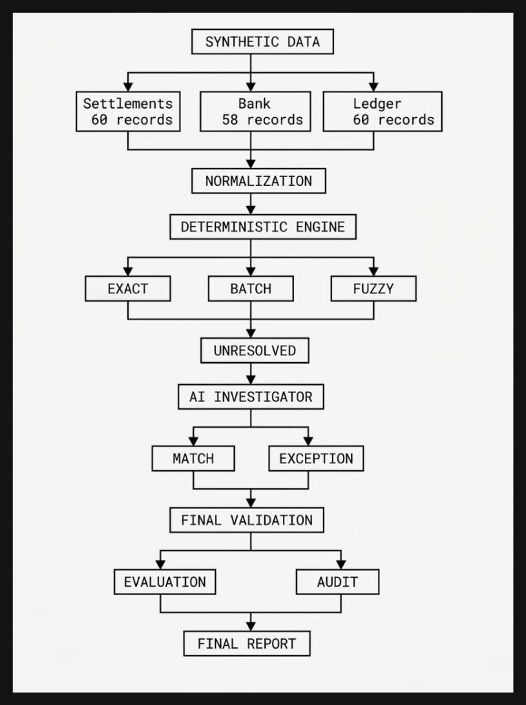
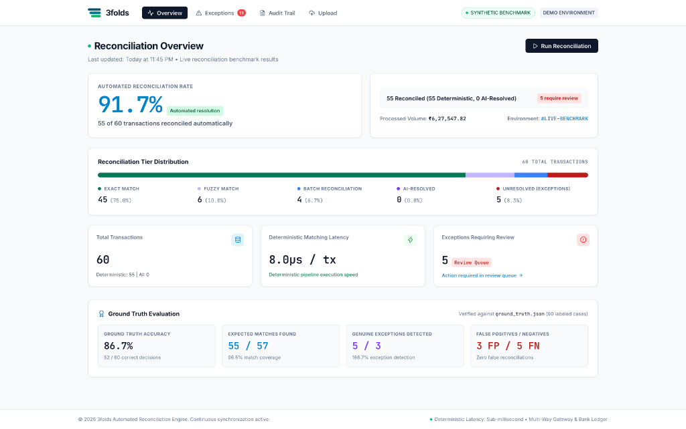
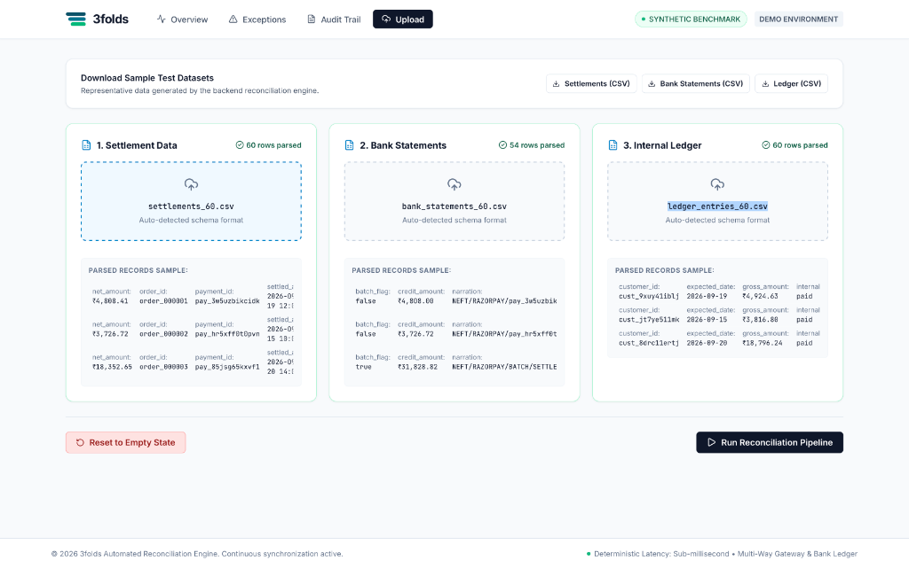

<p align="center">
  <picture>
    <source media="(prefers-color-scheme: dark)" srcset="assets/logo-dark.svg">
    <source media="(prefers-color-scheme: light)" srcset="assets/logo-light.svg">
    
  </picture>
</p>

<p align="center">
  <strong>Evidence-first multi-way financial reconciliation across payment gateways, bank statements, and internal ledgers.</strong>
  <br />
  
</p>

---

# 3folds — AI Finance Controller

**3folds** is an evidence-first finance reconciliation controller. It closes one finance-ops loop across settlement, bank, and internal ledger data: deterministic matching handles high-confidence cases, while an LLM investigates only unresolved cases and can leave them as auditable exceptions when evidence is insufficient.

## What it solves

A finance team needs to reconcile three views of the same money movement:

```text
Razorpay settlement  →  expected cash
Bank statement       →  actual cash
Internal ledger      →  accounting state
```

The difficult cases are not just exact matches. The synthetic dataset deliberately includes:

- clean matches
- fee-adjusted amounts
- unit / rounding differences
- settlement timing lag
- batched payouts
- genuine missing / unrelated transactions

The system must match what it can prove and **refuse to force-match what it cannot prove**.

## Results on the canonical 60-record dataset

Generated with `seed=42`.

| Metric | Result |
|---|---:|
| Settlements | **60** |
| Automatic reconciliation | **95.0%** |
| Classification accuracy | **100.0%** |
| Expected matches | **57** |
| Expected matches found | **57/57** |
| Genuine exceptions detected | **3/3** |
| False positives | **0** |
| False negatives | **0** |
| LLM cases reviewed | **3** |
| LLM cases upgraded to matches | **0** |
| LLM-confirmed exceptions | **3** |

Matcher performance for this 60-record run:

- **0.122 ms** processing time
- **491,469 records/sec** measured throughput

The accuracy claim is specifically **match/exception classification accuracy**, not a claim that every transaction was reconciled.

## Architecture

<p align="center">
  
</p>

### Matching policy

1. **Exact** — payment ID, amount, and date align.
2. **Fuzzy** — small amount or timing differences are tolerated within explicit bounds.
3. **Batch** — multiple real settlements are reconciled against one bank batch.
4. **Unresolved** — no sufficiently supported bank match exists.
5. **LLM review** — only unresolved cases are sent to the model. A `MATCH` requires high confidence, a valid candidate UTR, and multiple evidence items. Otherwise the case remains an exception.

The internal ledger is used as a validation signal so a bank match is not accepted solely because an amount happens to be similar.

## Reproducible run

Requirements:

- Go 1.25.5+
- A Groq API key for the LLM resolution step

Generate the canonical dataset:

```bash
go run ./cmd/threefolds generate -n 60 -seed 42 -out data
```

Run deterministic reconciliation:

```bash
go run ./cmd/threefolds match -in data
```

Run the LLM exception review:

```bash
export GROQ_API_KEY="your_key_here"
go run ./cmd/threefolds resolve -in data
```

Evaluate against generated ground truth:

```bash
go run ./cmd/threefolds evaluate -in data
```

Generate the HTML finance report:

```bash
go run ./cmd/threefolds report -in data
open data/report.html
```

Run the ground-truth verification directly:

```bash
go run ./cmd/threefolds verify -in data
```

Run tests:

```bash
go test ./...
```

## Interactive Web Dashboard

<p align="center">
  
</p>

To launch the live reconciliation UI:

**Terminal 1 — Backend API:**
```bash
go run ./cmd/threefolds serve -port 8080 -in data
```

**Terminal 2 — React Frontend:**
```bash
cd frontend && npm run dev
```

Open **http://localhost:5173/** in your browser.

### Resetting for a Demo Recording

To reset the dashboard to the clean **idle state** (no pre-baked numbers):
- Click **"Reset to Empty State"** in the UI on the **Upload** page, OR
- Run via curl:
  ```bash
  curl -X POST http://localhost:8080/api/reset
  ```
- Or delete match outputs manually:
  ```bash
  rm data/match_results*.json data/metrics.json data/resolutions.json
  ```

Source files (`settlements.json`, `bank_statements.json`, `ledger_entries.json`) remain intact so you can click **Run Reconciliation Pipeline** immediately to demonstrate the live execution flow.

## Data Ingestion & Live Pipeline Execution

<p align="center">
  
</p>

The interactive upload interface allows finance operators to:
- **Download Sample Datasets**: Pre-generated CSV and JSON templates representing settlements, bank statements, and internal ERP ledgers.
- **Upload & Schema Validation**: Real-time multi-file drag-and-drop parsing with schema auto-detection and data preview.
- **Execute Reconciliation Engine**: One-click live execution through deterministic rules and optional LLM resolution.
- **Reset to Empty State**: Instantly clear outputs to re-run demo flows on demand.


The pipeline produces:

- `settlements.json` — expected settlement records
- `bank_statements.json` — actual bank-side records
- `ledger_entries.json` — internal accounting records
- `ground_truth.json` — synthetic expected outcomes
- `match_results.json` — deterministic matcher output
- `match_results_final.json` — final output after LLM review
- `resolutions.json` — LLM decisions and evidence
- `evaluation.json` — measured classification performance
- `metrics.json` — measured matcher runtime and throughput
- `report.html` — finance-executive summary and full audit trail

## Why this is different

3folds is not designed to maximize the number of rows labelled `MATCH`.

It is designed around **evidence, measurement, and controlled escalation**:

> **Automate high-confidence reconciliation. Measure the result. Escalate ambiguity. Preserve the exception when evidence is insufficient.**

That makes the output useful as an operational finance control rather than just a text-generation demo.
